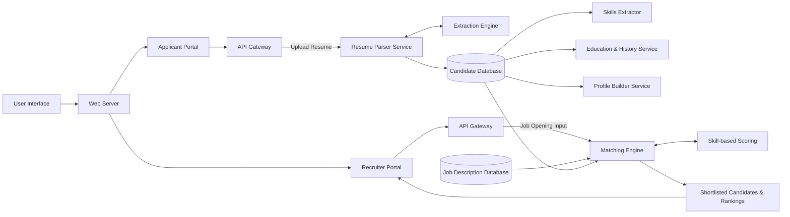
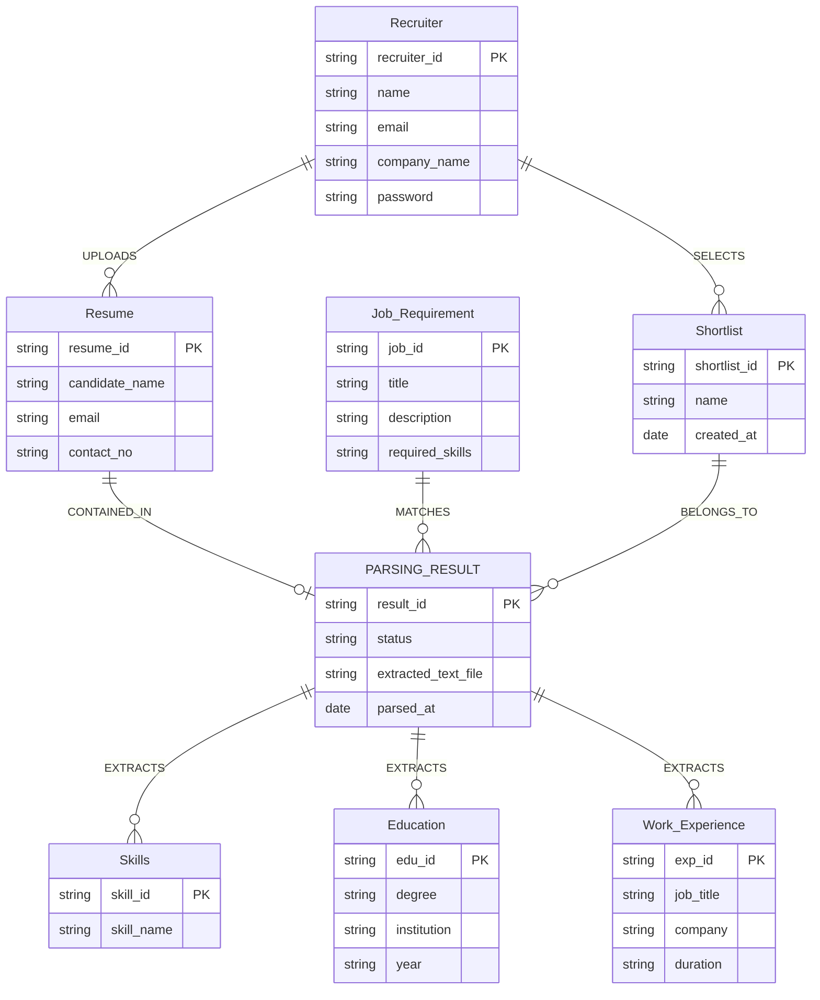
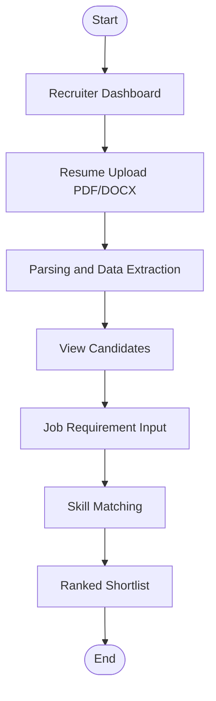

# Resume Parser & Matching Engine

A full-stack MERN application designed to automate and optimize the recruitment process. The system allows recruiters to upload candidate resumes (PDF/DOCX), automatically extracts structured data such as skills, education, and experience, and dynamically calculates a match score against predefined job requirements.

## Features

* **Resume Upload & ATS Analysis:** Candidates can upload resumes (PDF/DOCX) for real-time ATS scoring and feedback.
* **Recruiter & Candidate Portals:** Distinct dashboards for different user roles with tailored functionality.
* **Automatic Data Extraction:** Extract name, email, phone, skills, education, and experience using structured rules.
* **Role-Based Authentication:** Secure access control using JWT and Bcrypt, with automated redirection based on user role.
* **Job Creation:** Recruiters can define roles and specific required skills for open positions.
* **Dynamic Skill Matching Engine:** Calculate match scores in real-time based on job requirements.
* **Candidate Ranking:** Automatically sort and rank candidates by their match score for recruiters.
* **Detailed Analysis Reports:** Candidates receive actionable feedback on how to improve their resume for ATS compatibility.

## Tech Stack

**Frontend:** React.js, TailwindCSS, Axios, React Router DOM
**Backend:** Node.js, Express.js, JWT Authentication, Bcrypt.js, Multer
**Resume Parsing:** pdf-parse, mammoth, Regex + keyword-based parsing
**Database:** MongoDB, Mongoose

## System Architecture

The system follows a standard three-tier architecture utilizing the MERN stack.



## Entity-Relationship (ER) Diagram



## User Flow



## Project Structure

```text
root/
├── backend/
│   ├── controllers/
│   │   ├── candidate/    # Candidate specific controllers (Analysis)
│   │   ├── recruiter/    # Recruiter specific controllers (Jobs, Resumes, Matching)
│   │   └── authController.js # Shared auth controller
│   ├── middleware/       # JWT auth and Multer upload middlewares
│   ├── models/
│   │   ├── candidate/    # ResumeAnalysis schema
│   │   ├── recruiter/    # Job, Candidate (parsed) schemas
│   │   └── User.js       # Shared User schema
│   ├── routes/
│   │   ├── candidate/    # Candidate API routes
│   │   ├── recruiter/    # Recruiter API routes
│   │   └── authRoutes.js # Shared auth routes
│   ├── services/
│   │   ├── candidate/    # Candidate analysis services
│   │   └── recruiter/    # Recruiter parsing services
│   ├── uploads/          # Storage for uploaded resumes
│   └── server.js         # Entry point for backend
├── frontend/
│   ├── src/
│   │   ├── components/
│   │   │   ├── shared/   # Navbar and common components
│   │   ├── context/      # React AuthContext
│   │   ├── pages/
│   │   │   ├── candidate/# Candidate Dashboard, Upload, Analysis
│   │   │   ├── recruiter/# Recruiter Dashboard, Create Job, Matches
│   │   │   └── shared/   # Home, Login, Signup
│   │   ├── App.jsx       # React Router setup
│   │   └── main.jsx      # React DOM rendering
```

## Authentication Flow

The application utilizes stateless JWT-based authentication for secure access.

1. **Signup/Login:** User provides credentials which are hashed via Bcrypt and stored/verified in MongoDB.
2. **Token Generation:** Upon successful authentication, the server generates a JSON Web Token (JWT).
3. **Storage:** The frontend stores the JWT in local storage.
4. **Protected Routes:** The backend `authMiddleware` intercepts incoming requests, verifies the JWT signature, decodes the token, and attaches the full user profile to the request object to authorize recruiter actions.

## Resume Parsing Engine

The core parsing engine is entirely rule-based, designed to extract structured information from unstructured text without relying on external AI models.

* **Text Extraction:** Utilizes `pdf-parse` for PDF files and `mammoth` for DOCX files to extract raw textual data.
* **Pattern Matching:** Employs precise Regular Expressions (Regex) to reliably isolate email addresses and phone numbers.
* **Keyword Detection:** Scans the extracted text against a predefined `SKILLS_DATABASE`. It utilizes word-boundary regex (`\b`) to ensure accurate extraction and prevent partial word matches (false positives).
* **Section Mapping:** Identifies standard resume headers (e.g., "Experience", "Education") to break the document into parsable segments.

## Matching Algorithm

The system employs a dynamic matching engine. Candidate match scores are not statically stored in the database; instead, they are calculated in real-time when a recruiter requests to view matches for a specific job.

The logic intersects the candidate's parsed skills with the job's required skills.

```text
Match Score = (Matched Skills / Required Skills) × 100
```

*Example: If a job requires 4 skills and the candidate possesses 3 of them, their match score is calculated as 75%.*

## Installation Guide

### Prerequisites
* Node.js installed
* MongoDB installed and running locally (or a MongoDB Atlas URI)

### Backend Setup

1. Navigate to the backend directory:
   ```bash
   cd backend
   ```
2. Install dependencies:
   ```bash
   npm install
   ```
3. Create a `.env` file in the `backend` directory:
   ```env
   PORT=5000
   MONGODB_URI=mongodb://localhost:27017/resume-parser
   JWT_SECRET=your_secure_jwt_secret
   JWT_EXPIRE=7d
   ```
4. Start the backend server:
   ```bash
   npm run dev
   ```

### Frontend Setup

1. Navigate to the frontend directory:
   ```bash
   cd frontend
   ```
2. Install dependencies:
   ```bash
   npm install
   ```
3. Create a `.env` file in the `frontend` directory:
   ```env
   VITE_API_URL=http://localhost:5000/api
   ```
4. Start the development server:
   ```bash
   npm run dev
   ```

## API Endpoints

| HTTP Method | Endpoint | Description | Auth Required |
| :--- | :--- | :--- | :--- |
| POST | `/api/auth/signup` | Register a new user | No |
| POST | `/api/auth/login` | Authenticate and return JWT | No |
| GET | `/api/auth/profile` | Get current user profile | Yes |
| **Recruiter Routes** | | | |
| POST | `/api/jobs` | Create a new job requirement | Yes |
| GET | `/api/jobs` | Get all jobs created by recruiter | Yes |
| POST | `/api/resumes/upload` | Upload and parse a candidate resume | Yes |
| GET | `/api/resumes/candidates` | Get all parsed candidates | Yes |
| GET | `/api/matches/:jobId` | Calculate and return ranked candidates | Yes |
| **Candidate Routes** | | | |
| POST | `/api/candidate/upload` | Upload resume for personal ATS scan | Yes |
| GET | `/api/candidate/history` | Get scan history | Yes |
| GET | `/api/candidate/analysis/:id`| Get specific analysis report | Yes |

## Key Highlights

* **Dynamic Calculation:** Calculating match scores in real-time ensures that if a job's requirements are edited, match scores remain instantly accurate without requiring redundant database updates.
* **Heuristic Reliability:** Word-boundary keyword parsing ensures lightweight, deterministic extraction of technical skills.
* **Separation of Concerns:** Clean MVC backend architecture alongside modular React context state management.

## Limitations

* **Static Skill Database:** The system currently relies on a hardcoded array of skills. It will not identify niche or misspelled skills that are not present in the predefined database.
* **Format Dependency:** Parsing accuracy is highly dependent on standard resume formatting. Unconventional layouts or image-based PDFs may yield lower extraction accuracy.

## Future Improvements

* **Database-driven Skill Dictionary:** Move the static skill array into a MongoDB collection to allow recruiters to dynamically add or update industry-specific keywords.
* **OCR Support:** Implement optical character recognition (e.g., Tesseract.js) to parse scanned or image-heavy PDFs.
* **Export Functionality:** Allow recruiters to export the ranked list of candidates to CSV or Excel.

## Author

Karan Mani Tripathi and Team

## License

This project is open-source and available under the ISC License.
